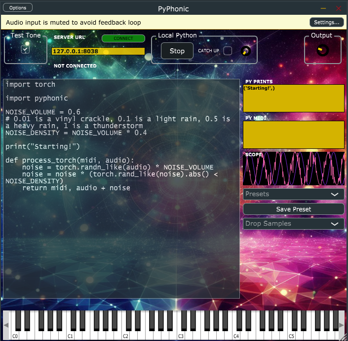

# Pyphonic

  

This is the Python library for the Pyphonic VST plugin.



Docs: https://audiofluff.github.io/PyPhonic/

The VST streams audio and midi to some server; the server responds with some processed audio.

This library is (one implementation of) the server component.

## Where do I get the VST?

The VST is not yet released. It's in the final stages of development with release _definitely happening_ in June 2024; you can sign up at https://audiofluff.com to get notified when it's released.

## Quickstart

##### Super Quick Demo

```bash
python -c "import pyphonic; from pyphonic.preset_11_polysynth import process;  pyphonic.start(process, 8020)"
```

An example using NumPy (recommended over basic Python):

```bash
python -c "import pyphonic; from pyphonic.preset_7_sampler import process_npy;  pyphonic.start(process_npy, 8020)"
```

An example using PyTorch:

```bash
python -c "import pyphonic; from pyphonic.preset_9_saturator import process_torch;  pyphonic.start(process_torch, 8020)"

```

Enter `127.0.0.1:8020` in the VST. Preset 11 sends notes in response to MIDI; preset 7 plays a sample in response to MIDI; preset 9 adds saturation to incoming audio.

##### Here's an example that simply echoes back the audio received from the server:

```python
import pyphonic

def process(midi, audio):
    return midi, audio

PORT = 8020
pyphonic.start(process, PORT)
```

Enter the url http://127.0.0.1:8020 in the VST and voila, you have a perfectly useless plugin.

##### Here's an example of a dynamic gain plugin

```python
import pyphonic

def process(midi, audio):
    left, right = audio[0], audio[1]
    if pyphonic.getBPM() > 140:
        return midi, [[x * 1.1 for x in left], [x * 1.1 for x in right]]
    return midi, [[0.0 for _ in left], [0.0 for _ in right]]

PORT = 8020
pyphonic.start(process, PORT)
```

##### Here's an example of NumPy

```python
import pyphonic

def process_npy(midi, audio):
    return [], audio * 0.5

PORT = 8020
pyphonic.start(process_npy, PORT)
```

## Next Steps

YMMV with network audio, particularly if you're running this server on a different computer than the VST.

That's why the Pyphonic VST also provides the ability to then take the **exact same Python code** and run it _within the VST_. In other words, the remote setup is great for POC and debugging, the next step is to run it in the VST itself. (Optional third step is then to translate the Python code to C++ but that's on you).

Remotely, you can use any third party Python lib installed in your environment (e.g. `PyTorch`). In the VST, currently, `numpy`, `scipy`, `torch` and `librosa` (which includes `numba` and `scikit-learn`) are offered.

## Docs

## Included Demos

Note: You will need to look at these files to see if they have a `process`, `process_npy` or `process_torch` function and use it accordingly.

4. `pyphonic.preset_4_butterworth` - a configurable high/low/bandpass filter
5. `pyphonic.preset_5_midiarp` - a beat sync'd minor triad MIDI arpeggiator
6. `pyphonic.preset_6_wavetable` - a wavetable synth or "ROMpler", demonstrating pitch shifting
7. `pyphonic.preset_7_sampler` - a time stretching wavetable synth
8. `pyphonic.preset_8_noise` - to be charitable, it adds a vinyl crackle or tape hiss to the audio
9. `pyphonic.preset_9_saturator` - a saturator/distortion effect, nice warmth on EDM drums; also has an electric guitar setting
10. `pyphonic.preset_10_fftramp` - Ramped FFT-based filtering, interesting effect.
11. `pyphonic.preset_11_polysynth` - a simple polyphonic sine wave synth
12. `pyphonic.preset_12_syncdnoise` - beat sync'd noise showing how to get transport info. Can add fizz after a kick.
13. `pyphonic.preset_13_sccompressor` - fake sidechain compressor, ducking the audio on the kick
14. `pyphonic.preset_14_nn_voice_change` - uses the SpeechT5 model and HifiGAN vocoder to transform one voice (vocal) to sound like a different speaker. Needs Huggingface and CUDA.
15. `pyphonic.preset_15_gen_midi` - generates a new MIDI chord every 2 bars with a configurable root note but based on the familiar C, G, Am, F progression. Markovian. DAW must be playing/recording for it to work.
16. `pyphonic.preset_16_gen_drums` - When DAW is **playing**, generates a repeating drum pattern. If you're holding C3 the pattern will have a kick, D3 the pattern also has a snare, E3 is closed hat, F3 is open hat, G3 is perc. Change the pattern with (any) midi control change. Must be piped in to a sampler.
17. (TODO) `pyphonic.reverb` - a reverb effect
18. (TODO) `pyphonic.delay` - a beat sync'd delay effect
19. (TODO) `pyphonic.pitcher` - a realtime pitch shift and time stretch effect for audio
20. (TODO) `pyphonic.deverb` - A deep learning model trained to remove reverb
21. (TODO) `pyphonic.source_separation` - A [deep learning model](https://pytorch.org/audio/stable/tutorials/hybrid_demucs_tutorial.html#sphx-glr-tutorials-hybrid-demucs-tutorial-py) trained to separate music into drums, bass, vocals and other

## Status

The VST is fully functional, hardly ever crashes the DAW, and stays quite performant even under heavy load.

As at late May 2024 the release will firmly be in June 2024. Just a few scary things to do like forming an LLC.

## Development

Contributions welcome!

In particular, the VST plugin automatically pulls `presets.json` and uses that to populate the presets dropdown. If you come up with a great preset and want to share it, please consider making a pull request.

## License

This Python package is licensed under the MIT license. The VST plugin is under separate license.

### How to add to presets.json

```
import json
f = open('my_python_file.py').read()
json.dump(f, open("ready_to_copy_paste_into_presets.json", "w"))
```