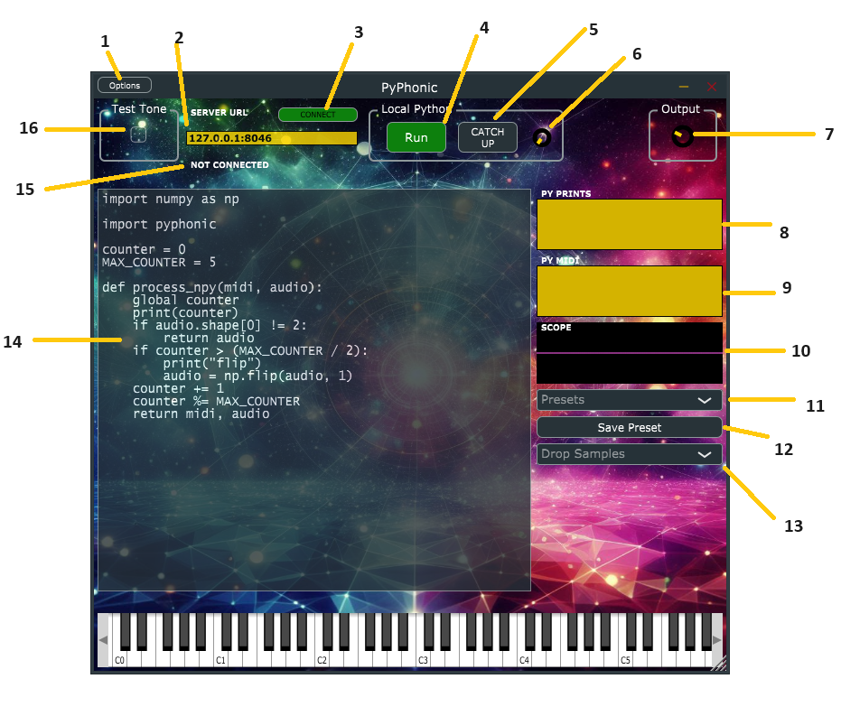

VST Plugin Guide
================

1. Options

Only present in the standalone plugin, opens up the dialog to set up audio and MIDI devices.

2. Server URL

If you have a running PyPhonic server, enter the URL here. Audio and MIDI will be streamed to the server, and its output streamed back out through the plugin. See the `installation guide <quickstart.html#networked>`__ to get started running the Python server. Enter the URL in the format `<ip>:<port>`, without any `http://`.

3. Connect Button

Click this button to connect to the server. If the server is not running, the plugin will not connect. If the server disconnects, the plugin will disconnect and remain disconnected.

4. Run Button

Sets the code from code box (14) running. The code runs in a loop, with the `process` function (which `must` be defined - either `process` if you want the audio as a Python list, `process_npy` for a NumPy array, or `process_torch` for a PyTorch tensor) being called on each block of audio (one block of audio is `num_channels` x `num_samples`, where `num_samples` is controlled by your audio latency settings). This button may be automated in the DAW.

5. Catch Up Button

PyPhonic buffers incoming audio and MIDI, feeding it to locally running Python when it can. If your code is running slowly, so that one call to `process` takes longer than the latency set in your DAW, the plugin might be so far behind that it sounds very out of sync with the rest of your track. This button, which can be automated in the DAW, will clear all buffers so that, at least for a while, things are back in sync. Best used when the track is quiet.

6. Extra Latency Dial

If your code has some heavy initialization or runs slowly, increasing this dial lets a number of audio blocks accumulate before the first call to `process`, so the output audio will always be a little behind (the dial's max is 1000 blocks). Leave this set at 0 unless you're experiencing latency issues, drop out, or glitches.

7. Gain 

Regular old output gain knob that controls the output volume of the plugin.

8. Py Prints

Any `print` statements in your Python code will display their output here, which is helpful for debugging. (Print statements in imported libraries, and log statements, will not be displayed here). This only applies to local/embedded Python code; if you're running the code in a server, they will show up in the server's terminal.

9. Py MIDI

MIDI messages output by your Python code will display here, including messages coming from networked Python.

10. Scope

This displays the left/0th channel of incoming audio (purple) and the code/server's output audio (pink). While audio can - but probably shouldn't - go above 0dB (+/- 1.0), the top of the scope is 1.0 and the bottom is -1.0.

11. Presets

This dropdown will show presets loaded both from the PyPhonic Github repo (https://github.com/AudioFluff/PyPhonic/blob/main/presets.json) - which is what the plugin needs internet access for - and any local presets you have saved. Selecting a preset will populate the code box with its code.

12. Save Preset Button

This saves the current contents of the code box as a preset.

Before saving the preset, have two lines at the top of the code:

.. code-block:: python

    # my_awesome_preset
    # This preset is just the best. Really.

The first line will be the name of the preset which will from then on appear in the dropdown (11). The second line is a description.

Presets are saved as `.py` files in the PyPhonic data directory. The save location is platform dependent but on Windows 10/11 it's ``C:\Users\<username>\AppData\Roaming\AudioFluff\PyPhonic``.

13. Drop Samples

You can drop .wav or .mp3 files here. Samples will be saved as `.pkl` files in the PyPhonic data directory which can be accessed with ``pyphonic.getDataDir()`` (same folder whether you're running networked - on localhost of course - or embedded/local). Again, on Windows, this is typically ``C:\Users\<username>\AppData\Roaming\AudioFluff\PyPhonic``.

The pickle - a NumPy array - will be of shape `(num_channels, num_samples)`. You can load the sample with Pickle or NumPy:

.. code-block:: python

    import pickle
    with open(f'{pyphonic.getDataDir()}/<filename>.pkl', 'rb') as f:
        sample = pickle.load(f)
    
    # or

    import numpy as np
    sample = np.load(f'{pyphonic.getDataDir()}/<filename>.pkl', allow_pickle=True)

Added samples (any ``.pkl`` files in the PyPhonic data directory) will be present in the dropdown. If you select one, the code to load it will be added to the code box (14). This is a helpful utility if you're building a wavetable synth or sampler, for example.

14. Code Box

Write code here then hit Run (4).

15. Connection Status

Visual confirmation whether or not the plugin is connected to a server over the network.

16. Test Tone

If toggled on, the plugin will generate a 440Hz stereo tone. This will be added on top of incoming audio, if any, and feed into the `audio` parameter of any running code. If code is not running (either network or embedded), the plugin's output will be the tone.